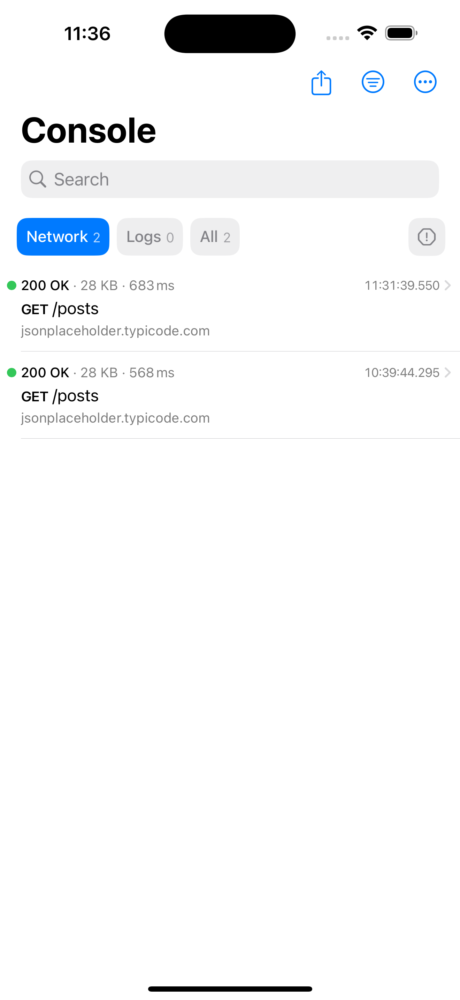
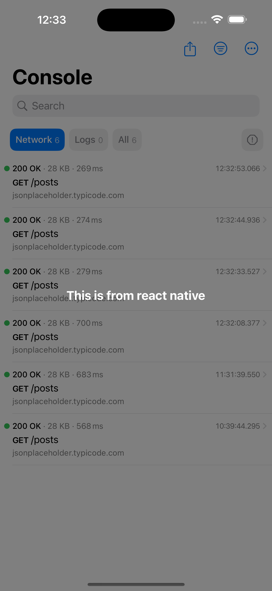

# expo-network-logger

a library for wrapping [Pulse](https://pulselogger.com/) in React Native (Expo) and [Chucker](https://github.com/ChuckerTeam/chucker) in React Native (Expo).

It's only for iOS at the moment.

| ConsoleView (SwiftUI)                                                | PulseLoggerView (with react native view)                              |
| -------------------------------------------------------------------- | --------------------------------------------------------------------- |
|  |  |

## Table of Contents

- [expo-network-logger](#expo-network-logger)
  - [Table of Contents](#table-of-contents)
  - [Installation](#installation)
    - [Installation in managed Expo projects](#installation-in-managed-expo-projects)
    - [Installation in bare React Native projects](#installation-in-bare-react-native-projects)
    - [Add the package to your npm dependencies](#add-the-package-to-your-npm-dependencies)
  - [Configuration](#configuration)
    - [Configure for iOS](#configure-for-ios)
  - [Usage](#usage)
    - [Enable logging](#enable-logging)
    - [Show Pulse Logger View](#show-pulse-logger-view)
  - [Contributing](#contributing)

## Installation

### Installation in managed Expo projects

For [managed](https://docs.expo.dev/archive/managed-vs-bare/) Expo projects, please follow the installation instructions in the [API documentation for the latest stable release](#api-documentation). If you follow the link and there is no documentation available then this library is not yet usable within managed projects &mdash; it is likely to be included in an upcoming Expo SDK release.

### Installation in bare React Native projects

For bare React Native projects, you must ensure that you have [installed and configured the `expo` package](https://docs.expo.dev/bare/installing-expo-modules/) before continuing.

### Add the package to your npm dependencies

Using npm:

 ```bash
npm install expo-network-logger
```

Using yarn:

```bash
yarn add expo-network-logger
```

Using pnpm:

```bash
pnpm add expo-network-logger
```

Using bun:

```bash
bun add expo-network-logger
```

## Configuration

### Configure for iOS

You will need to make sure that your iOS deployment target is 14.0 or later.

1. Using expo plugin **(Recommended)**:

    ```bash
    npx expo install expo-build-properties
    ```

    in `app.json`

    ```json
    {
      "plugins": [
        [
          "expo-build-properties",
          {
            "ios": {
              "deploymentTarget": "14.0"
            }
          }
        ]
      ]
    }

    ```

2. Manually (Not Recommended):

    Navigate to `ios/Podfile` and replace this line with `platform :ios, '14.0'`

    ```diff
    - platform :ios, podfile_properties['ios.deploymentTarget'] || '13.4'
    + platform :ios, '14.0'
    ```

Run `npx pod-install` after installing the npm package.

## Usage

### Enable logging

```typescript
import { enableLogging } from "expo-network-logger";

enableLogging(true);
```

### Show Pulse Logger View

```tsx
import { ReactNativePulseLoggerView } from "expo-network-logger";

<ReactNativePulseLoggerView style={{ flex: 1 }} />
```

## Contributing

Contributions are very welcome! Please refer to guidelines described in the [contributing guide]( https://github.com/expo/expo#contributing).
